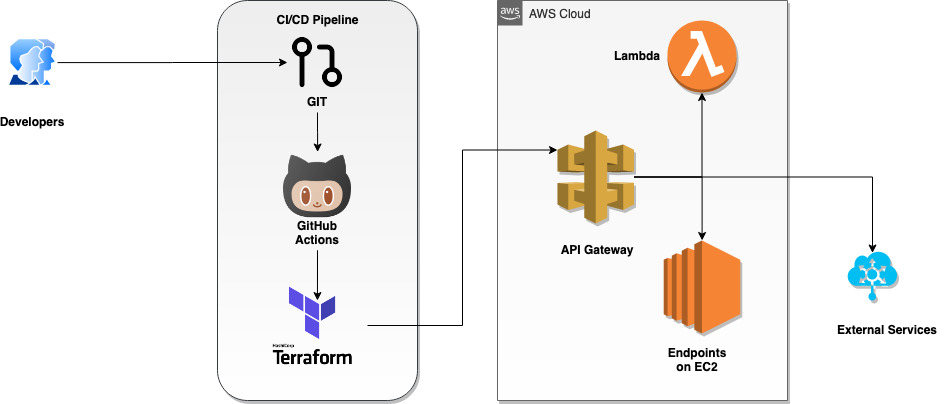

<!-- ⚠️ This README has been generated from the file(s) "blueprint.md" ⚠️--><h1 align="center">aws-api-gateway-example</h1>

<p align="center">
		<a href="https://img.shields.io/badge/proof--of--concept-in--progress-blue"></a>
<a href="https://github.com/AWS-Terraform-Projects/AWS-API-Gateway/actions/workflows/terraform.yml"></a>
	</p>


 A Terraform project for provisioning an AWS API Gateway using an OpenAPI specification file to configure each route in the gateway. The project will also use Terragrunt to keep the configurations DRY. Terraform Cloud is used to manage the the project's remote files. GitHub Actions is used to implement the CI/CD pipeline


[](#cicd-pipeline-for-aws-api-gateway-using-github-actions--terraform)

## ➤ CI/CD pipeline for AWS API Gateway using GitHub Actions & Terraform
<kbd></kbd>


[](#installing-and-running-this-project)

## ➤ Installing and running this project
<details>
  <summary>Prerequisites for running this project</summary>
  
#### The project has the following dependencies  
- AWS CLI version 2
- Terraform CLI 0.14.2 
</details>

<details>
  <summary>Initialize and run this proect</summary>
  
#### Initialize Terraform using S3 as the remote backend
> To intialize Terraform using S3 as the remote backend, edit the `backend_s3.hcl` file, replace the following properties:
>
> bucket = "S3 bucket name"
>
> key    = "Path to the terraform.tfstate"
>
> region = "AWS region where this bucket is located"
>
> After the `backend_s3.hcl` file has been updated with the S3 bucket details, edit the `main.tf' file to use 's3' as the remote backend
>
>
> Now run the below command to initialize S3 with the terraform state files:
> ```bash
> terraform init -backend-config=backend_s3.hcl
> ```

#### Initialize Terraform using Terraform Cloud as the remote backend
> To intialize Terraform using S3 as the remote backend, edit the `backend.hcl` file, replace the following properties:
>
> workspaces { name = "Name of your Terraform Cloud Workspace" }
>
> organization = "Name of your Terraform Cloud organization"
>
>> *For instructions on setting up your free Terraform Cloud Account see [Getting Started with Terraform Cloud](https://learn.hashicorp.com/collections/terraform/cloud-get-started)*
>> 
>> Set the below 3 properties as environment variables in your Terraform Cloud workspace:
>> * AWS_DEFAULT_REGION 
>> * AWS_SECRET_ACCESS_KEY (**Use the sensitive checkbox to protect this value!!**)
>> * AWS_ACCESS_KEY_ID (**Use the sensitive checkbox to protect this value!!**)
>
> After the `backend.hcl` file has been updated with the Terraform Cloud's organization and workspace details, run the below command to login to your Terraform cloud workspace
>
> ```bash
> terraform login
> ```
>
> After a successful login, initialize your Terraform Cloud workspace with the terraform state files:
> ```bash
> terraform init -backend-config=backend.hcl
> ```

#### Run the standard Terraform workflow commands
>
> To validate your terraform project, run the below command
>
> ```bash
> terraform validate
> ```
>
> To review the final plan and terraform changes before applying them, run the below command
>
> ```bash
> terraform plan
> ```
>
> To apply the changes and provision the AWS API Gateway, run the below command
>
> ```bash
> terraform apply
> ```
>
> To clean-up and delete the provisioned AWS resources, run the below command
>
> ```bash
> terraform destroy
> ```
</details>
